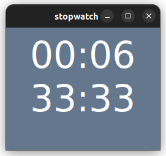

# Stopwatch
This is about as dumb as a stopwatch can be. There are only two things on screen:
 * the current lap time,
 * and the total elapsed time.

These are formatted as mm:ss. If you run longer than 99 minutes, it won't display very well.

It starts immediately on opening, and the only way to stop it is to exit the program. Clicking anywhere on the screen resets the lap time.

It depends on PySimpleGUI, and maybe could serve as an introductory PySimpleGUI example.

## Why?
Why did I need to write such a simple program? I use this when I'm exercising. I lay out a YouTube video, my spreadsheet, and this timer in one small corner of the screen. It needs to make the time as large as possible for the size of the window, and be easy to quickly tap to reset the timer. I don't want any extra buttons or clicks. I just want to know how long my current set or rest has been so far.
